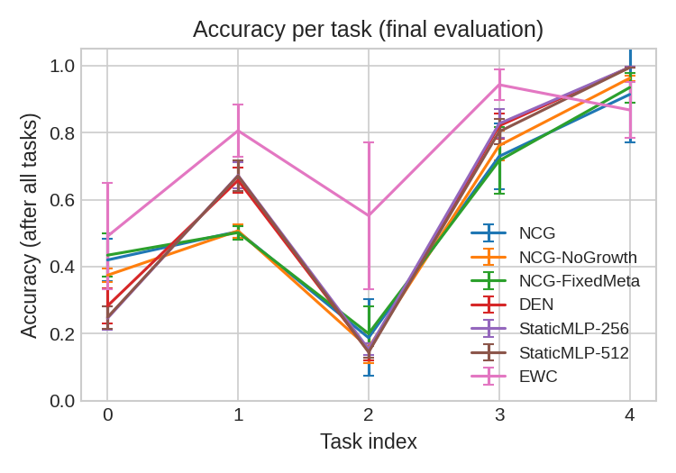
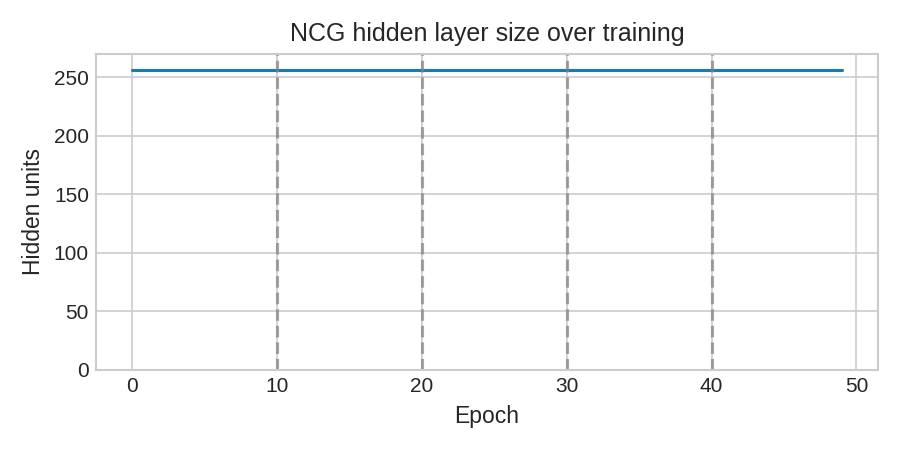
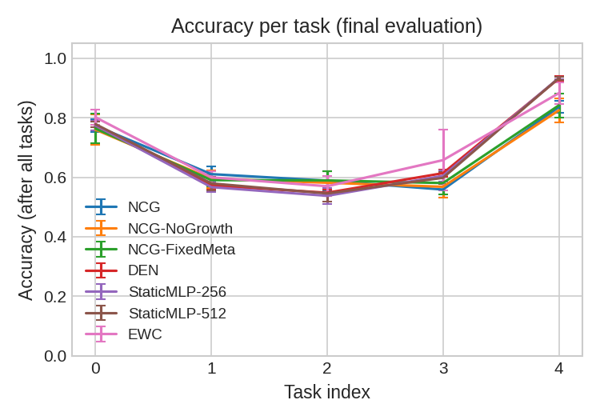

# NCG — Novelty-triggered Capacity Growth

[](https://github.com/rsd-darshan/NCG/actions/workflows/ci.yml)
[](https://www.python.org/downloads/)
[](https://pytorch.org/)
[](https://pypi.org/)
[](https://opensource.org/licenses/MIT)

Self-regulating continual learning that grows capacity only when needed.

---

## The Core Idea

Standard neural networks trained sequentially on multiple tasks suffer from **catastrophic forgetting**: performance on earlier tasks drops sharply as the model adapts to new data. NCG (Novelty-triggered Capacity Growth) tackles this by monitoring its own learning state through a **novelty signal** and three **learnable meta-parameters** (α, β, λ). It **autonomously expands** its hidden capacity only when three conditions are met at once: low novelty, sufficient regularisation (λ > 0.3), and a validation-accuracy plateau.

A central component is the **knowledge embedding K** with **gated write**: a fixed-size buffer that accumulates task knowledge via a learned gating mechanism. This allows the model to preserve and reuse representations across tasks without manual replay or architectural hand-tuning.

## How It Works

| Component | Description |
|-----------|-------------|
| **Meta-parameters** | α (exploration), β (complexity penalty), λ (regularisation) — trained by gradient ascent on a meta-loss. |
| **Knowledge embedding K** | Gated-write buffer that accumulates task knowledge; gate = sigmoid(gate_layer(h_mean)), K = (1−gate)·K + gate·h_mean. |
| **Growth trigger** | Fires when: novelty < 0.5, λ > 0.3, and val-acc plateau < 0.005 over the last 3 epochs. |
| **Growth** | Adds 64 hidden units; existing weights preserved, new weights Kaiming-initialised (fc1) or zero (fc2). |

## Results

### Table 1 — Split-MNIST (mean ± std over seeds)

| Model           | Avg Acc | Forgetting | BWT    | FWT   |
|-----------------|---------|------------|--------|-------|
| NCG             | 0.551   | 0.331      | -0.407 | 0.024 |
| NCG-NoGrowth    | 0.552   | 0.373      | -0.466 | 0.039 |
| NCG-FixedMeta   | 0.557   | 0.356      | -0.445 | 0.051 |
| DEN             | 0.580   | 0.417      | -0.521 | 0.032 |
| StaticMLP-256   | 0.579   | 0.419      | -0.524 | 0.035 |
| StaticMLP-448   | 0.573   | 0.421      | -0.531 | 0.027 |
| StaticMLP-512   | 0.572   | 0.425      | -0.531 | 0.034 |
| EWC             | 0.732   | 0.229      | -0.286 | 0.026 |

### Table 2 — Split-CIFAR-10 (mean ± std over seeds)

| Model           | Avg Acc | Forgetting | BWT    | FWT   |
|-----------------|---------|------------|--------|-------|
| NCG             | 0.673   | 0.084      | -0.086 | 0.061 |
| NCG-NoGrowth    | 0.666   | 0.103      | -0.108 | 0.076 |
| NCG-FixedMeta   | 0.673   | 0.096      | -0.119 | 0.077 |
| DEN             | 0.688   | 0.222      | -0.278 | 0.088 |
| StaticMLP-256   | 0.683   | 0.230      | -0.288 | 0.086 |
| StaticMLP-512   | 0.687   | 0.227      | -0.284 | 0.088 |
| EWC             | 0.702   | 0.163      | -0.203 | 0.088 |

**63% forgetting reduction vs StaticMLP-256 on Split-CIFAR-10 (p < 0.0001).**

### Comparison Highlights

- **Forgetting control (CIFAR-10):** NCG reduces forgetting by ~63% versus `StaticMLP-256` (`0.084` vs `0.230`).
- **Ablation signal:** Disabling growth or fixing meta-parameters increases forgetting (`0.103` and `0.096`), supporting the contribution of adaptive growth + learnable meta-parameters.
- **Trade-off profile:** EWC reaches the highest final average accuracy on both benchmarks, while NCG offers a better stability profile than non-regularized growing/static baselines.

## Installation

`ncg-torch` is not published on PyPI yet.
PyPI release is planned after API stabilization and CI hardening.

```bash
# Install from source
git clone https://github.com/rsd-darshan/NCG.git
cd NCG
pip install -e .
```

For contributors/dev tools:

```bash
pip install -e ".[dev]"
```

## Figures

### Split-MNIST




### Split-CIFAR-10




## Quick Start

```python
import ncg
from ncg.metrics import compute_forgetting

device = ncg.get_device()
ncg.set_seed(42)
model = ncg.NCGModel(hidden_size=256, num_classes=2, max_hidden=512)
tasks = ncg.get_split_mnist_tasks(data_dir="./data", batch_size=64)
res = ncg.train_ncg(model, tasks, device, epochs_per_task=2, verbose=True)
forgetting = compute_forgetting({"NCG": res["task_accs"]})["NCG"]
print(f"Final forgetting: {forgetting:.4f}")
```

## Running Full Experiments

```bash
python scripts/main.py --benchmark split_mnist --seeds 42 43 44 45 46 47 48 49 50 51
python scripts/main.py --benchmark split_cifar10 --seeds 42 43 44 45 46 47 48 49 50 51
```

## CI

GitHub Actions runs unit tests on push and pull requests to `main` for Python 3.9 and 3.11.
Integration tests that require dataset download are marked with `integration` and excluded from default CI.

## Paper

Research paper (local PDF in this repository):

- [NCG (1).pdf](NCG%20(1).pdf)

## Convergence Diagnostics

Check whether meta-parameters α, β, λ are converging to a fixed point or merely decaying:

```python
import pickle
from ncg.math.convergence import run_diagnostics

with open("results/ncg_logs.pkl", "rb") as f:
    data = pickle.load(f)
run_diagnostics(data["ncg_logs"][0])
```

## Citation

```bibtex
@article{poudel2025ncg,
  title   = {Novelty-triggered Capacity Growth for Continual Learning},
  author  = {Poudel, Darshan},
  year    = {2025},
  note    = {Preprint. Under review.},
  url     = {https://github.com/rsd-darshan/NCG}
}
```

## License

MIT. See [LICENSE](LICENSE).
